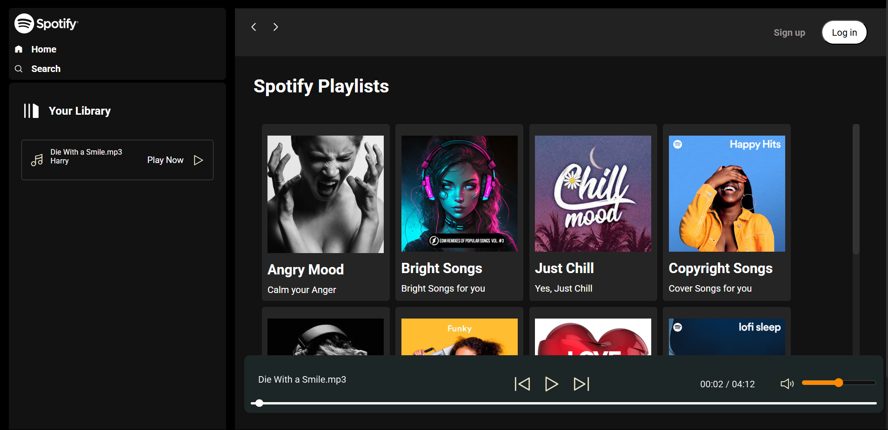

# 🎵 Spotify Clone 

A modern web-based Spotify clone with immersive music playback experience and elegant UI design.

](./image.png)

## 🌟 Features

### 🎨 UI Components
- **Hero Section**
  - Spotify-branded header with seamless navigation
  - Promotional banners for premium membership
- **Authentication Flow**
  - Modern signup/login forms with email validation
  - Secure user session management
- **Music Navigation**
  - Left sidebar with quick access:
    - Your Library
    - Play Now section
    - Custom playlist categories
  - Main content area with dynamic grid layout

### 🎶 Playlist Categories
- Mood-based Collections:
  - 😊 Happy Hits
  - 😡 Cain your Anger 
  - ☀️ Bright Songs for you
  - ❄️ Yes, Just Chill
  - 🎭 Cover Songs for you
  - 🕺 Funky Beats
  - 😴 Ioff sleep
- Dynamic Music Player
  - Current track display (Die With a Smile.mp3 shown)
  - Progress bar with time tracking (00:02/04:12)
  - Playback controls

## 🛠️ Technologies Used

### Frontend


### Additional Tools


## 🚀 Installation & Usage

1. Clone repository:
```bash
git clone https://github.com/yourusername/spotify_clone.git